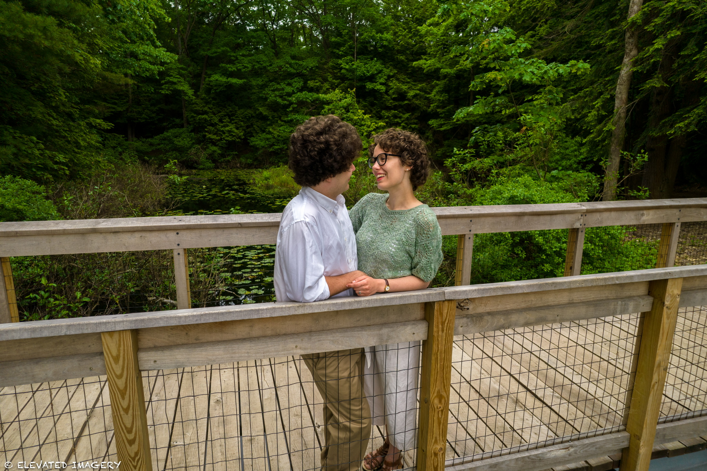

<html lang="en">
<head>
  <meta charset="UTF-8">
  <meta name="viewport" content="width=device-width, initial-scale=1.0">
  <title>Elevated Imagery | Drone & Camera Photography</title>
  <link rel="icon" type="image/x-icon" href="/static/favicon.ico">
  
  <link href="https://unpkg.com/aos@2.3.1/dist/aos.css" rel="stylesheet">
  
  
  
  
body {
  background: url('images/background.jpg') no-repeat center center;
  background-size: cover;
}

/* Only apply parallax fixed effect on desktop */
@media (min-width: 768px) {
  body {
    background-attachment: fixed; }
}
  </style>
</head>

<!-- Navigation -->
<nav class="fixed top-0 left-0 w-full z-50 bg-white shadow-md">
  

    

      <!-- Logo -->
      

        <a href="#" class="flex-shrink-0 flex items-center">
          <i data-feather="camera" class="h-8 w-8 text-blue-600"></i>
          Elevated Imagery
        </a>
      

      <!-- Desktop Menu -->
      

        <a href="#" class="text-blue-600 border-b-2 border-blue-600 px-3 py-2 text-sm font-medium">Home</a>
        <a href="#services" class="text-gray-700 hover:text-blue-600 px-3 py-2 text-sm font-medium">Services</a>
        <a href="#portfolio" class="text-gray-700 hover:text-blue-600 px-3 py-2 text-sm font-medium">Portfolio</a>
        <a href="#about" class="text-gray-700 hover:text-blue-600 px-3 py-2 text-sm font-medium">About</a>
        <a href="#contact" class="text-gray-700 hover:text-blue-600 px-3 py-2 text-sm font-medium">Contact</a>
      

      <!-- Mobile Menu Button -->
      

        <button id="menu-button" type="button" class="p-2 rounded-md text-gray-700 hover:text-blue-600 focus:outline-none">
          <i data-feather="menu" class="h-6 w-6"></i>
        </button>
      

    

  

  <!-- Mobile Menu (hidden by default) -->
  

    

      <a href="#" class="block text-blue-600 px-3 py-2 rounded-md text-base font-medium">Home</a>
      <a href="#services" class="block text-gray-700 hover:bg-blue-100 px-3 py-2 rounded-md text-base font-medium">Services</a>
      <a href="#portfolio" class="block text-gray-700 hover:bg-blue-100 px-3 py-2 rounded-md text-base font-medium">Portfolio</a>
      <a href="#about" class="block text-gray-700 hover:bg-blue-100 px-3 py-2 rounded-md text-base font-medium">About</a>
      <a href="#contact" class="block text-gray-700 hover:bg-blue-100 px-3 py-2 rounded-md text-base font-medium">Contact</a>
    

  

</nav>

  <!-- Hero Section -->
<section class="relative w-full h-screen flex items-center justify-center">
  

    

  

  

    <h1 class="text-4xl md:text-6xl font-bold text-white mb-6">Capture The World From New Perspectives</h1>
    

      Professional drone and camera photography services for Real Estate, Events, and Personal projects.
    

    

      <a href="#contact" class="bg-white text-blue-600 hover:bg-blue-600 hover:text-white px-6 py-3 rounded-lg font-medium shadow-lg transition duration-300">
        Book a Session
      </a>
      <a href="#portfolio" class="bg-white border-2 border-white text-blue-600 hover:bg-blue-600 hover:text-white px-6 py-3 rounded-lg font-medium transition duration-300">
        View Portfolio
      </a>
    

  

</section>

<!-- Services Section -->
<section id="services" class="py-24">
  

    <h2 class="text-3xl font-bold mb-12">Our Services</h2>
    

      
      <!-- Real Estate -->
      

        
        

          <h3 class="text-2xl font-semibold text-gray-900">Real Estate Photography</h3>
          
Showcase properties with stunning aerial and interior visuals that captivate buyers.

        

      

      <!-- Event Coverage -->
      

        
        

          <h3 class="text-2xl font-semibold text-gray-900">Event Coverage</h3>
          
Capture the magic of your special events from unique aerial perspectives and ground level moments.

        

      

      <!-- Commercial Projects -->
      

        
        

          <h3 class="text-2xl font-semibold text-gray-900">Commercial Projects</h3>
          
Professional photography for businesses, construction sites, and large-scale projects.

        

      

    

  

</section>

<!-- Portfolio Section -->
<section id="portfolio" class="py-24">
  

    <h2 class="text-3xl font-bold mb-12">Our Portfolio</h2>
    
      <!-- Real Estate -->
      <a href="real-estate.html" class="block bg-white rounded-2xl shadow-lg overflow-hidden hover:shadow-2xl transition">
        
        

          <h3 class="text-xl font-semibold text-gray-900">Real Estate</h3>
          
Elegant Homes

        

      </a>

      <!-- Event Photography -->
      <a href="event-photography.html" class="block bg-white rounded-2xl shadow-lg overflow-hidden hover:shadow-2xl transition">
        
        

          <h3 class="text-xl font-semibold text-gray-900">Event Photography</h3>
          
Wedding Celebration

        

      </a>

      <!-- Portraits -->
      <a href="portrait.html" class="block bg-white rounded-2xl shadow-lg overflow-hidden hover:shadow-2xl transition">
        
        

          <h3 class="text-xl font-semibold text-gray-900">Portraits</h3>
          
Express Yourself

        

      </a>

      <!-- Automotive -->
      <a href="automotive.html" class="block bg-white rounded-2xl shadow-lg overflow-hidden hover:shadow-2xl transition">
        
        

          <h3 class="text-xl font-semibold text-gray-900">Automotive Photography</h3>
          
Power & Style

        

      </a>

      <!-- Landscape -->
      <a href="landscape-photography.html" class="block bg-white rounded-2xl shadow-lg overflow-hidden hover:shadow-2xl transition">
        
        

          <h3 class="text-xl font-semibold text-gray-900">Landscape Photography</h3>
          
Beautiful Scenes

        

      </a>

      <!-- Sports -->
      <a href="sports-photography.html" class="block bg-white rounded-2xl shadow-lg overflow-hidden hover:shadow-2xl transition">
        
        

          <h3 class="text-xl font-semibold text-gray-900">Sports Photography</h3>
          
Action Shots

        

      </a>

    

    <!-- View Full Portfolio Button -->
    

      <a href="full-portfolio.html"
         class="inline-flex items-center px-8 py-4 border border-transparent text-lg font-medium rounded-xl shadow-md text-white bg-blue-600 hover:bg-blue-700">
        View Full Portfolio
        <i data-feather="arrow-right" class="ml-2"></i>
      </a>
    

  

</section>

    <!-- About Section -->
 <section id="about" class="py-20 bg-gray-50">
        

            

                

                    
                

                

                    <h2 class="text-3xl md:text-4xl font-bold text-gray-900 mb-6">About Elevated Imagery</h2>
                    
Founded in May 2025, Elevated Imagery has been at the forefront of aerial and traditional photography, combining technical expertise with artistic vision to deliver stunning visual content.

                    
Our team of FAA-certified drone pilots and professional photographers work together to capture images that tell your story from perspectives you've never seen before.

                    

                        

                            

                                

                                    <i data-feather="award" class="text-blue-600"></i>
                                

                            

                            

                                
FAA Certified Pilots

                                
All our drone operators are fully licensed and insured.

                            

                        

                        

                            

                                

                                    <i data-feather="camera" class="text-blue-600"></i>
                                

                            

                            

                                
Professional Equipment

                                
We use High end drones, DSLR cameras, and Flashes.

                            

                        

                        

                            

                                

                                    <i data-feather="edit" class="text-blue-600"></i>
                                

                            

                            

                                
Post-Production

                                
Every image is professionally edited for maximum impact.

                            

                        

                    

                

            

        

    </section>

    <!-- Testimonials Section -->
    <section class="py-20 bg-blue-600 text-white">
        

            

                <h2 data-aos="fade-up" class="text-3xl md:text-4xl font-bold mb-4">Client Testimonials</h2>
                
What our clients say about our work

            

            
            

                <!-- Testimonial 1 -->
                

                    

                        
                        

                            <h4 class="text-lg font-semibold">Tony Stark</h4>
                            
Real Estate Agent

                        

                    

                    
"The aerial shots Elevated Imagery provided for our luxury listings helped us sell properties 30% faster than before. Their attention to detail is unmatched."

                    

                        <i data-feather="star" class="fill-current"></i>
                        <i data-feather="star" class="fill-current"></i>
                        <i data-feather="star" class="fill-current"></i>
                        <i data-feather="star" class="fill-current"></i>
                        <i data-feather="star" class="fill-current"></i>
                    

                

                
                <!-- Testimonial 2 -->
                

                    

                        
                        

                            <h4 class="text-lg font-semibold">Tyler Selhorst</h4>
                            
Client

                        

                    

                    
"Outstanding quality photos, Had a few photos and videos done from a mountain biking trip and they were absolutely stunning!!"

                    

                        <i data-feather="star" class="fill-current"></i>
                        <i data-feather="star" class="fill-current"></i>
                        <i data-feather="star" class="fill-current"></i>
                        <i data-feather="star" class="fill-current"></i>
                        <i data-feather="star" class="fill-current"></i>
                    

                

                
                <!-- Testimonial 3 -->
                

                    

                        
                        

                            <h4 class="text-lg font-semibold">Kyle Rees</h4>
                            
Sports Client

                        

                    

                    
"Best pictures and drone videos of all time!! Really great quality and quick work."

                    

                        <i data-feather="star" class="fill-current"></i>
                        <i data-feather="star" class="fill-current"></i>
                        <i data-feather="star" class="fill-current"></i>
                        <i data-feather="star" class="fill-current"></i>
                        <i data-feather="star" class="fill-current"></i>
                    

                

            

        

    </section>
    
    <!-- Parallax Section -->
<section class="relative w-full h-96 flex items-center justify-center bg-fixed bg-center bg-cover"
         style="background-image: url('//images/aerial.14.jpg');">
  

  

    <h2 data-aos="fade-up" class="text-3xl md:text-4xl font-bold text-white mb-4">Ready to Elevate Your Visual Content?</h2>
    <a data-aos="fade-up" data-aos-delay="100" href="#contact" class="inline-flex items-center px-6 py-3 rounded-md bg-white text-blue-600 hover:bg-blue-50">
      Get in Touch
      <i data-feather="arrow-right" class="ml-2"></i>
    </a>
  

</section>

    <!-- Contact Section -->
    <section id="contact" class="py-20 bg-white">
  

    

        
      <!-- Left column: Contact info -->
      

        <h2 class="text-3xl md:text-4xl font-bold text-gray-900 mb-6">Contact Us</h2>
        

          Have a project in mind or want to discuss your photography needs? 
          Reach out to us and we'll get back to you within 24 hours.
        

        

          

            

              

                <i data-feather="mail" class="text-blue-600"></i>
              

            

            

              
Email

              
elevatedimagery.co.llc@gmail.com

            

          

          

            

              

                <i data-feather="phone" class="text-blue-600"></i>
              

            

            

              
Phone

              
(406) 295-2589

            

          

          

            

              

                <i data-feather="map-pin" class="text-blue-600"></i>
              

            

            

              
Service Broadband

              
State of Delaware (DE), United States of America

            

          

        

      

      <!-- Right column: Form + Follow Us -->
      

        

          <form id="contact-form" action="https://formspree.io/f/mdklrpba" method="POST" class="space-y-4">
            <!-- Name -->
            <input type="text" name="name" placeholder="Your Name" class="w-full p-2 border rounded-md" required>

            <!-- Email -->
            <input type="email" name="email" placeholder="Your Email" class="w-full p-2 border rounded-md" required>

            <!-- Service Dropdown -->
            <select name="service" class="w-full p-2 border rounded-md" required>
              <option value="">Select a Service</option>
              <option value="Real Estate Photography">Real Estate Photography</option>
              <option value="Drone Photography">Drone Photography</option>
              <option value="Event Coverage">Event Coverage</option>
              <option value="Other">Other</option>
            </select>

            <!-- Message -->
            <textarea name="message" placeholder="Your Message" class="w-full p-2 border rounded-md" rows="5" required></textarea>

            <!-- Submit -->
            <button type="submit" class="px-4 py-2 bg-blue-600 text-white rounded-md hover:bg-blue-700">
              Send Message
            </button>
          </form>

          <!-- Success / Error Message -->
          

          <!-- Follow Us -->
          

            <h3 class="text-lg font-semibold text-gray-900 mb-4">Follow Us</h3>
            

              <a href="https://www.instagram.com/elevated_imagery.co/" target="_blank" class="w-12 h-12 flex items-center justify-center rounded-full bg-gradient-to-tr from-pink-500 via-red-500 to-yellow-500 text-white hover:opacity-90 transition">
                <i data-feather="instagram"></i>
              </a>
              <a href="https://www.facebook.com/share/15vMGx44dk/?mibextid=wwXIfr" target="_blank" class="w-12 h-12 flex items-center justify-center rounded-full bg-blue-600 text-white hover:bg-blue-700 transition">
                <i data-feather="facebook"></i>
              </a>
              <a href="http://www.youtube.com/@elevatedimagery-co" target="_blank" class="w-12 h-12 flex items-center justify-center rounded-full bg-red-600 text-white hover:bg-red-700 transition">
                <i data-feather="youtube"></i>
              </a>
            

          

        

      

    

  

</section>

    <!-- Footer -->
    <footer class="bg-gray-900 text-white py-12">
        

            

                

                    <h3 class="text-lg font-semibold mb-4">Elevated Imagery</h3>
                    
Professional drone and camera photography services for businesses and individuals.

                

                
                

                    <h3 class="text-lg font-semibold mb-4">Services</h3>
                    <ul class="space-y-2">
                        <li><a href="#" class="text-gray-400 hover:text-white">Real Estate</a></li>
                        <li><a href="#" class="text-gray-400 hover:text-white">Events</a></li>
                        <li><a href="#" class="text-gray-400 hover:text-white">Commercial</a></li>
                        <li><a href="#" class="text-gray-400 hover:text-white">Real Estate</a></li>
                    </ul>
                

                
                

                    <h3 class="text-lg font-semibold mb-4">Company</h3>
                    <ul class="space-y-2">
                        <li><a href="#about" class="text-gray-400 hover:text-white">About Us</a></li>
                        <li><a href="#portfolio" class="text-gray-400 hover:text-white">Portfolio</a></li>
                        <li><a href="#" class="text-gray-400 hover:text-white">Testimonials</a></li>
                        <li><a href="#contact" class="text-gray-400 hover:text-white">Contact</a></li>
                    </ul>
                

                
                

                    <h3 class="text-lg font-semibold mb-4">Legal</h3>
                    <ul class="space-y-2">
                        <li><a href="#" class="text-gray-400 hover:text-white">Privacy Policy</a></li>
                        <li><a href="#" class="text-gray-400 hover:text-white">Terms of Service</a></li>
                        <li><a href="#" class="text-gray-400 hover:text-white">Cookie Policy</a></li>
                    </ul>
                

            

            
            

                
© 2025 Elevated Imagery LLC. All rights reserved.

                

                    <a href="https://www.instagram.com/elevated_imagery.co/" target="_blank" class="text-gray-400 hover:text-white">
                        <i data-feather="instagram"></i>
                    </a>
                    <a href="https://www.facebook.com/share/15vMGx44dk/?mibextid=wwXIfr" target="_blank" class="text-gray-400 hover:text-white">
                        <i data-feather="facebook"></i>
                    </a>
                    <a href="http://www.youtube.com/@elevatedimagery-co" target="_blank" class="text-gray-400 hover:text-white">
                        <i data-feather="youtube"></i>
                    </a>
                

            

        

    </footer>
    
      
